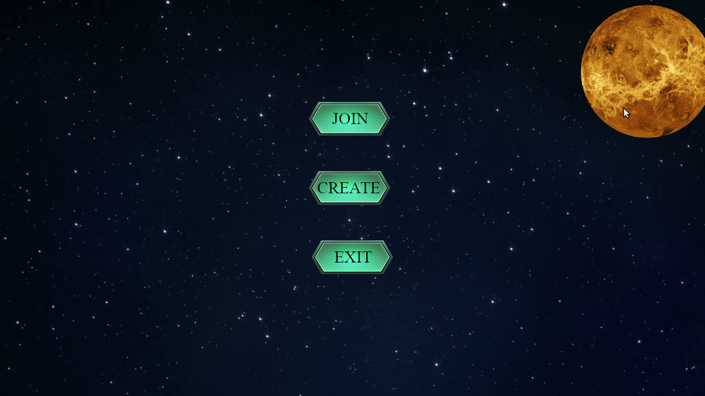

# RType

Rtype is a copy of the RType game made in 1987.
Rtype Works with an ECS (Entities Components Systems)
This project is made in C++ with sfml gaphical library & boost_asio.

### Execute :
$ ./Compile
## Start Server 
$ ./Build/Server/bin/server <port>
## Start Client & connect it to the server
$ ./Build/Client/bin/client <ip> <port>

### Game :

Move
Forward : "Z"
Backward : "S"
Right : "D"
Left : "Q"

Fire : Space Bar
